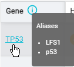

Coming real soon now

---

# |- Why ?

  ⚙️ Mercury has not been created with customisation in mind

  🙃 With each new features the soft is harder to maintain

  👓 Responsabilities between front and back are uncleared

  👶 The front stack (Twig/jQuery) is a bit weak for complex UI

  ⚠️ API endpoints does not respect any REST conventions 

  ⏳ Mercury does not bring great UX with long loading times, infinite tab opening, no direct links, etc...

---

# |- How ?

  🚀 API REST 
    ✅ PHP 8 
    ✅ Symfony 5.4
  ⚡ React
  🐋 Docker
  🔥 Google Cloud Platform

---

# |- New

Alias des noms de gènes 
  - La recherche peut se faire sur les alias des noms de gènes
  - Les alias sont affichés dans les résultats de recherche
  - Les alias sont affichés dans les détails d'un gène

Un back-office pour les bioinfs et les commerciaux qui permet de :
  - Créer des utilisateurs
  - Créer des licences
  - Ajouter des crédits aux licences
  - Gérer les analyses dans les licences
  - Gérer les utilisateurs dans les licences
  - Gérer les rôles des utilisateurs pour chaque licence

---

# |- Update

Les comptages vont être relancés sur chaque analyse
  - Les comptages seront plus précis
  - Une seule source de vérité (au lieu de 3 actuellement)

Les filtres sont maintenant personnelles
  - Ils peuvent aussi être partagés avec d'autres utilisateurs de ses licences
  - Nouvelle page de gestion des filtres

Nouveau système de cloud-function pour gérer les demandes d'analyses en ligne
  - Plus de problème de token qui expire pendant l'upload : 
    -- Les analyses auront le bon statut
    -- Les emails pour prévenir les bioinfs d'une nouvelle analyse seront envoyés
  - Les analyses ne se crées pas à l'avance mais uniquement quand l'upload aboutit
  - Les crédits se débitent quand l'upload aboutit

---

# ConfigManager 🔧

---

## What is configurable ?

📊 Filters
  - CNA, exons, fusions, germline, somatic, RNA only, QC genes, QC hotspots

🧮 Counting filters
  - CNA, germline, somatic, QC Genes, QC Hotspots

🖥️ Overview

📋Report blocks

---
## How is it better ?

One place instead of being spread in the code

App code is now designed to be more flexible and is not anymore an accumulation of special cases

New config as easy as a copy/paste thanks to overriding/inheritance

Powerfull JSON syntax accessible for everyone (bioinf, dev) _(yet to be documented)_

Versionning of the configuration thanks to git

No more need to deploy the app to change the config

New config slice can be considered more easily
