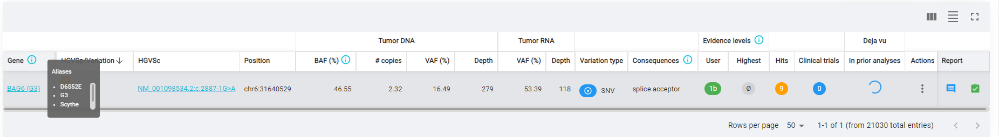
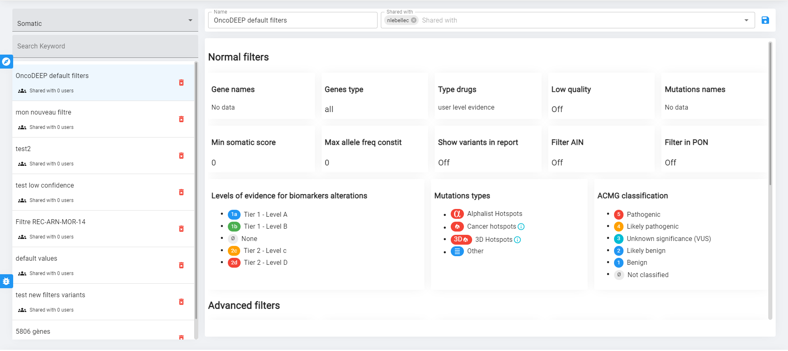

Coming real soon now

---

# |- Why ?

  ⏳ Mercury does not bring great UX with long loading times, infinite tab opening, no direct links, etc...

  ⚙️ Mercury has not been created with customisation in mind

  🙃 With each new features the soft is harder to maintain

  👓 Responsabilities between front and back are uncleared

  👶 The front stack (Twig/jQuery) is a bit weak for complex UI

  ⚠️ API endpoints does not respect any REST conventions 

---

# |- How ?

🚀 API rework
- ✅ PHP 8 
- ✅ Symfony 5.4
- ✅ More RESTful

⚡ New UI with improved UX
- ⚛️ React
- 🚅 React Router
- 🔄 React Query

🐋 Docker
🔥 Google Cloud Platform

---

# |- What changed ?

---

## |- User experience

Mercury **feels** and **IS** faster

Client side navigation
  - No more page reload
  - No more infinite tab opening

Caching

Direct links are now working + new UI part are now linkable

Dark mode

---

# Some User stories

---

## From connection to PDF

- Login to Overview
- Overview to results
- Click variant to modal
- Id card button to page  
- Go back to somatic page
- Change filters to result
- Clicinal report link to page

Legacy : https://www.loom.com/share/5b45b11d702349c899d5c78cf475bf0a
Rework : https://www.loom.com/share/cdd431d776a941f3bcf76e513898b208

---
## Results

| Step                         | Legacy | Rework | Absolute gain (s) | Relatif gain (%) |
|------------------------------|-------:|-------:|------------------:|-----------------:|
| Login to Overview            |     28 |     19 |                 -9 |               -32 |
| Overview to results          |     20 |      5 |                -15 |               -75 |
| _Click variant to modal_     |   _23_ |    _0_ |              _-23_ |            _-100_ |
| Id card button to page       |      6 |      4 |                 -2 |               -33 |
| Go back to somatic page      |     19 |      0 |                -19 |              -100 |
| _Change filters to result_   |   _32_ |    _7_ |              _-25_ |             _-78_ |
| Clicinal report link to page |     29 |      9 |                -20 |               -69 |

---

## Somatic table navigation

| Step                           | Legacy | Rework | Absolute gain (s) | Relatif gain (%) |
|--------------------------------|-------:|-------:|------------------:|-----------------:|
| Default filters to new filters |      9 |      6 |                 -3 |               -33 |
| to page 2                      |      5 |      5 |                 0 |                0 |
| to page 1                      |      9 |      0 |                 -9 |              -100 |
| to default filters             |      6 |      0 |                 -6 |              -100 |

---

## Page navigation

| Step                        | Legacy | Rework | Absolute gain (s) | Relatif gain (%) |
|-----------------------------|-------:|-------:|------------------:|-----------------:|
| Dashboard to overview       |      6 |      3 |                -3 |              -50 |
| overview to somatic results |     18 |      3 |               -15 |              -83 |
| to dashboard                |     13 |      0 |               -13 |             -100 |
| dashboard to overview       |      6 |      0 |                -6 |             -100 |
| overview to somatic results |     20 |      0 |               -20 |             -100 |

---

# Easier configuration with ConfigManager 🔧

---

## What is configurable ?

📊 Filters
  - CNA, exons, fusions, germline, somatic, RNA only, QC genes, QC hotspots

🧮 Counting filters
  - CNA, germline, somatic, QC Genes, QC Hotspots

🖥️ Overview

📋Report blocks

---
## How is it better ?

One place instead of being spread in the code

App code is now designed to be more flexible and is not anymore an accumulation of special cases

New config as easy as a copy/paste thanks to overriding/inheritance

Powerfull JSON syntax accessible for everyone (bioinf, dev) _(yet to be documented)_

Versionning of the configuration thanks to git

No more need to deploy the app to change the config

New config slice can be considered more easily

---

# Maintenance 📆
---

## Back office

Create easely with a dedicated interface : 

- Users
- Licences
- Credits
- Analyses
- Assign analysis to licences
- Assign users to licences

Use "User impersonation" to see what a user see and debug more easily

---
# Other new features or improvments 🎉

## Alias 🧬

Mercury is now handling gene aliases

All aliases are searchable. No risk to miss a variant because of using other gene name

Dejavu service can now find previous encountered variants even if the gene name was different at the time

---

## Favorite filters ⭐

New visualisation of favorite filters

Favorite filters can now be shared with other users of the same licences

---

## New counting system 🧮

Finally counting have a predictable behaviour !

Filters done to count now go through the same code as the one used to display the results

Filters are setup in configManager (which means they are fully configurable)

CNA counts (Amplificaitons, deletions, cnLOH) are now done on CNA results and not anymore on the CNA present in somatic results

**Counting has been restarted on all analyses.**

All in all, the counting is now more __predictable__ and __configurable__ !

---

## New upload alerts 🌩️

Upload alerts are now handled by a cloud function

The email is now sure to be sent **after** all files has been uploaded

Analysis on Mercury is **only** created if all files are uploaded and successfully processed

Credits are **only** debited if all files are uploaded and successfully processed

--- 

# What's next ?

---

## Open beta is ready

An open beta will start soon to have real user feedback

Daily DB sync

⚠️ User password has to be reset for Mercury new version

---

## What's left ?

Bioinf pipelines need to use the new API for a real launch